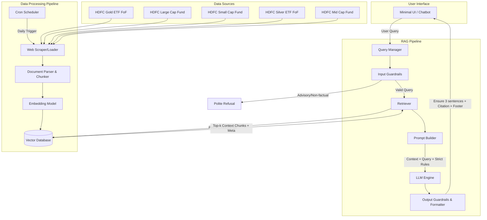

# Architecture Design: Mutual Fund FAQ Assistant (Facts-Only Q&A)

This document outlines the system architecture for the Retrieval-Augmented Generation (RAG)-based mutual fund FAQ assistant. The architecture is designed to prioritize accuracy, traceability, and strict compliance with the "facts-only" constraint.

## 1. High-Level Architecture Diagram

## 2. Component Breakdown

### 2.1. Data Processing Pipeline (Offline Phase)
Responsible for ingesting the specified mutual fund scheme pages, processing the text, and storing it for fast retrieval. **Crucially, the corpus is restricted strictly to the HTML content of the 5 provided Groww URLs. No PDFs (like official factsheets or SIDs) or external links will be scraped or included.**

*   **Web Scraper / Loader:** Fetches HTML content exclusively from the 5 provided Groww URLs. Extracts meaningful text (tables, paragraphs, lists) while discarding noisy elements like ads or navigation bars.
*   **Document Parser & Semantic Chunker:** Instead of stripping all HTML, this uses a semantic chunking approach (e.g., `HTMLHeaderTextSplitter` followed by `RecursiveCharacterTextSplitter`) to preserve the document structure. This ensures tabular data (like Expense Ratios) remains contextually tied to its headers. Retains metadata for each chunk, critically including the **Source URL**, **HTML Headers**, and **Scraping Date**.
*   **Embedding Model:** Converts the semantically-chunked text and its structural metadata into dense vector representations using a BGE embedding model (e.g., `BAAI/bge-small-en-v1.5` via HuggingFace). The embeddings are metadata-aware to better capture the relationship between HTML headers and their values.
*   **Vector Database:** Stores the embeddings along with their metadata. A lightweight local vector store like **ChromaDB** or **FAISS** is recommended for simplicity and low latency.

### 2.2. RAG Pipeline (Online Phase)
Handles the real-time user queries, retrieves context, and generates the final response.

*   **Query Manager & Input Guardrails:** 
    *   Receives the user query.
    *   **Crucial Step:** Passes the query through a lightweight classifier or heuristic filter to detect if it's asking for advice, opinions, or comparisons (e.g., "Should I invest?", "Which is better?").
    *   If flagged, it triggers a standard refusal response (e.g., "I can only provide factual information...").
*   **Retriever:** Converts the user's valid query into an embedding and performs a similarity search against the Vector Database to fetch the top-$k$ most relevant context chunks.
*   **Prompt Builder:** Constructs the prompt for the LLM. It combines:
    *   The user's query.
    *   The retrieved context chunks.
    *   **Strict System Instructions:** "Answer using ONLY the provided context. Do not provide advice. Keep the answer under 3 sentences. Include exactly one source link."
*   **LLM Engine:** The core generative model (e.g., Llama-3 via Groq) that reads the prompt and synthesizes the factual answer.
*   **Output Guardrails & Formatter:** A post-processing step that ensures the LLM's output complies with the strict constraints:
    1.  Truncates or verifies the length is $\le$ 3 sentences.
    2.  Extracts the metadata from the retrieved chunks to append the exact source link.
    3.  Appends the mandatory footer: `Last updated from sources: <date>`.

### 2.3. User Interface (UI)
A minimal, lightweight frontend (built with **Streamlit** or **Gradio**).

*   **Welcome Area:** Displays the mandatory disclaimer prominently: *"Facts-only. No investment advice."*
*   **Interactive Elements:** Provides 3 clickable example questions to guide user expectations (e.g., "What is the exit load for HDFC Large Cap Fund?").
*   **Chat Interface:** A simple input box and response display area.

### 2.4. Data Ingestion Scheduler
Ensures the local ChromaDB vector store remains synchronized with the latest data from the official URLs.

*   **GitHub Actions CI/CD:** A scheduled workflow (`.github/workflows/schedule_ingestion.yml`) that runs the Data Processing Pipeline (`ingest.py`) on a daily cadence using GitHub's runner infrastructure.
*   **Update Mechanism:** The workflow sets up Python, installs dependencies, re-fetches the live HTML, generates new BGE embeddings, and replaces or updates the stale context in the Vector Database. This guarantees users receive the most current facts (such as updated NAV or AUM figures) automatically.

## 3. Security & Compliance Measures

To adhere strictly to the problem statement's constraints:
1.  **Zero Data Retention Policy:** The application state must not log or persist any PII (PAN, Aadhaar, phone numbers). The system is stateless across sessions.
2.  **No Calculators/Comparisons:** The system prompt will explicitly instruct the LLM to refuse requests to calculate returns or compare funds against each other.
3.  **Traceability:** Every single answer is mapped directly to a chunk in the Vector DB, which is mapped to one of the 5 official URLs. Hallucination risk is mitigated by instructing the LLM to output "I do not have this information in my provided sources" if the answer is missing from the retrieved context.

## 4. Technology Stack Recommendation
*   **Language:** Python 3.10+
*   **Orchestration Framework:** LangChain or LlamaIndex
*   **Vector Database:** ChromaDB (Local/Lightweight)
*   **Embedding/LLM Provider:** Groq API for lightning-fast LLM inference, and HuggingFace/BGE for open-source embeddings.
*   **Frontend:** Streamlit
